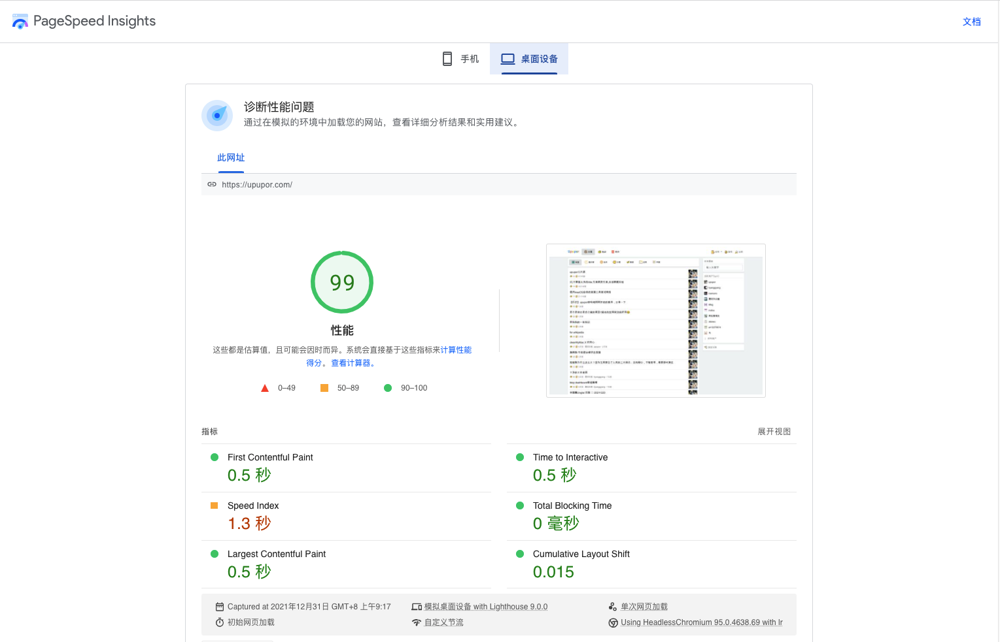

# Upupor
让每个人享受分享

## 网站
https://www.upupor.com

## QA
### 为什么采用 thymeleaf 建站?
upupor用 thymeleaf 的原因是为了做SEO,目前所有页面均采用服务端渲染。在做upupor网站的初期(2019年)前端框架SSR还不成熟,所以没有采用前端SSR.
现在前端SSR方案成熟了很多,现在如果做SEO的话,可以采用前端SSR.

### 计划使用前端SSR方案重构upupor吗?
目前没有计划,我们永远不要为了"技术而技术! 一个项目是否够好要看是否满足需求。
当然成本也在考虑的范围内,有多少资源做多少事情。一个人开发的时候才用最小技术栈永远是最优的选择。所以从这一点来说,upupor适合单人作战.

### Upupor接入了哪些三方服务?
1. Google分析 https://marketingplatform.google.com/about/analytics/?hl=zh-CN
2. Google广告 https://www.google.com/intl/zh-CN_cn/adsense/start/

### upupor页面加载性能如何?
下面是Google PageSpeed Insights桌面版的测试结果


## 系统变量
> 如果配置有特殊字符,需要加转义字符
```
export MYSQL_HOST=mysql数据库host
export MYSQL_PORT=mysql数据库端口
export MYSQL_USERNAME=mysql数据库用户名
export MYSQL_PASSWORD=mysql数据库密码
export MYSQL_DATABASE=mysql数据库
export REDIS_HOST=redis host
export REDIS_PORT=redis端口
export REDIS_PASSWORD=redis密码
export ALLOW_UPLOAD_PIC_SUFFIX=允许上传图片的后缀
export ALLOW_UPLOAD_PIC_QUALITY=允许上传图片的质量
export EMAIL_ON=邮件开关(0-关闭 -1开启)
export EMAIL_SENDER_NICK_NAME=邮件发送昵称
export EMAIL_SENDER_ACCOUNT=邮件发送账户
export EMAIL_ACCESS_KEY=访问Key
export EMAIL_ACCESS_SECRET=访问秘钥 
export WEBSITE=网站
export AD_SWITCH=是否开启广告(0-关闭 -1开启)
export AD_SWITCH_RIGHT=是否开启右侧广告(0-关闭 -1开启)
export ANALYZE_SWITCH=分析开关(0-关闭 -1开启)
export OSS_BUCKET_NAME=阿里OSS桶名
export OSS_FILE_HOST=阿里OSS文件host
export OSS_STATIC=阿里OSS静态文件路径
export LUENCE_INDEX_DIC=全文索引路径
export THYMELEAF_CACHE=THYMELEAF缓存开关 true false
export LOG_PATH=日志打印地址
export UPUPOR_ENV=环境
export GOOGLE_DATA_AD_CLIENT_ID=Google广告Id
export GOOGLE_AD_RIGHT=右侧广告
export GOOGLE_AD_FEED=信息流广告
export GOOGLE_TAG_ID=Google分析Id
```

## 应用内环境变量
> 此为示例,请根据实际情况修改
```
MYSQL_HOST=localhost;MYSQL_PORT=3306;MYSQL_USERNAME=root;MYSQL_PASSWORD=123456;MYSQL_DATABASE=open_base;REDIS_HOST=localhost;REDIS_PORT=6379;REDIS_PASSWORD=;ALLOW_UPLOAD_PIC_SUFFIX=jpg;ALLOW_UPLOAD_PIC_QUALITY=0.5;EMAIL_ON=0;EMAIL_SENDER_NICK_NAME=;EMAIL_SENDER_ACCOUNT=;EMAIL_ACCESS_KEY=;EMAIL_ACCESS_SECRET= ;WEBSITE=http://localhost:2020;AD_SWITCH=0;AD_SWITCH_RIGHT=0;ANALYZE_SWITCH=0;OSS_BUCKET_NAME=;OSS_FILE_HOST=;OSS_STATIC=http://localhost:2020;LUENCE_INDEX_DIC=;THYMELEAF_CACHE=false;LOG_PATH=/Users/yangrunkang/logs;UPUPOR_ENV=dev;GOOGLE_DATA_AD_CLIENT_ID=;GOOGLE_AD_RIGHT=;GOOGLE_AD_FEED=;GOOGLE_TAG_ID=
```